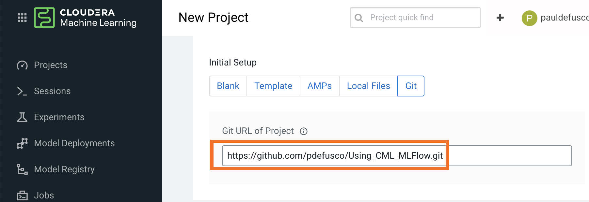
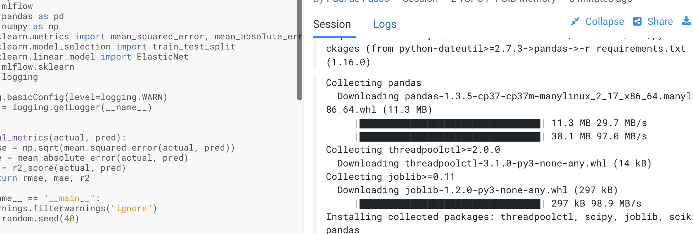
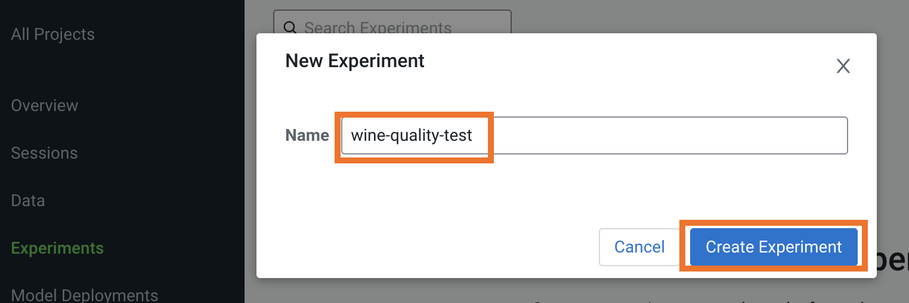
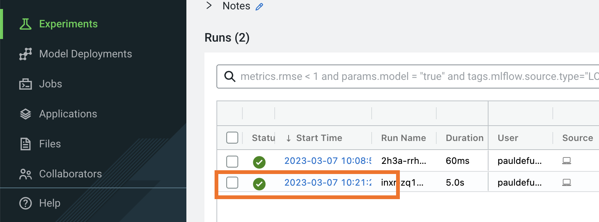
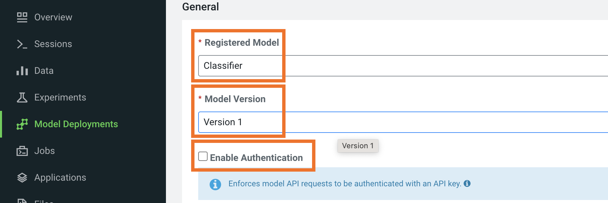

# Using ML Flow in CML

This project demonstrates Key ML Flow functionality in CML, the Cloudera Machine Learning Data Service available in CDP Private and Public Cloud.

CDP Machine Learning (CML) enables enterprise data science teams to collaborate across the full data lifecycle with immediate access to enterprise data pipelines, scalable compute resources, and access to preferred tools for MLOps such as MLFlow.

MLflow is an open source platform to manage the ML lifecycle, including experimentation, reproducibility, deployment, and a central model registry. CML currently supports two MLFlow components: Experiments and Registry.

To learn more about the Cloudera Machine Learning Service please visit the documentation at [this page](https://docs.cloudera.com/machine-learning/cloud/product/topics/ml-product-overview.html).
To learn more about MLFlow please visit the project documentation at [this page](https://mlflow.org/).


## Overview

Machine Learning requires experimenting with a wide range of datasets, data preparation steps,
and algorithms to build a model that maximizes a target metric. Once you have built a model,
you also need to deploy it to a production system, monitor its performance, and continuously
retrain it on new data and compare it with alternative models.

CML lets you train, reuse, and deploy models with any library, and package them into
reproducible artifacts that other data scientists can use.
CML packages the ML models in a reusable, reproducible form so you can share it with other
data scientists or transfer it to production.

CML is compatible with the MLflow tracking API and makes use of the MLflow client library as
the default method to log experiments. Existing projects with existing experiments are still
available and usable.

## Tutorial Requirements

To reproduce this quickstart you need:

1. A CML Workspace on Azure, AWS or Private Cloud

2. Although very code changes are required, familiarity with Python is recommended


## Part 1: CML Experiment Tracking and Model Deployment

#### 1. Create a CML Project using this Github repository. Name the project "DEV".

Create a new project named "DEV".


Use the ```https://github.com/pdefusco/Using_CML_MLFlow.git``` URL to clone the project from Git.



Select a Python runtime for the project with version 3.7 or above.


#### 2. Install the requirements in the DEV CML Project.

Open a CML Session with a runtime option of Python 3.7 or above and Workbench Editor. Leave the Spark Add On option unchecked.


A basic resource profile with 1 vCPU and 2 GiB Mem or more is enough. No GPU's required.


Execute ```!pip3 install -r requirements.txt``` in the prompt (optionally running "pip3 install -r requirements.txt" from the terminal window).




#### 3. Run Your First MLFlow Experiment

Open the "Experiments" tab and create a new experiment named ```wine-quality-test```.





Next, open "code/01_Experiment.py" in the Workbench Editor in your CML Session and run the entire script by pressing the "play" button at the top.


Navigate back to the Experiments tab, locate the "wine-quality-test" experiment and validate that a new Experiment Run has been logged.


Scroll down to the Artifacts section. Click on "Model" in the "Artifacts" section. Notice that this is empty. This is because we have not logged the model related to this Experiment Run.

Go back to your Session and execute ```02_Experiment_log_model.py```. Notice that the script is almost identical to "01_Experiment.py" with the exception for line 71. This is where the mlflow API is used to log the model i.e. store model artifacts in the associated Experiment.


Validate that a second Experiment Run has been added in the Experiments page. Open the Run, scroll down and validate that Model Artifacts have been logged.




#### 4. Register and Deploy Your First MLFlow Model

Navigate back to the Projects Homepage and create a new empty project named "PRD". Later, we will deploy the model here.

Next, navigate back to the Experiments tab. Locate your experiment and click on the ```Model``` folder. On the right side the UI will automatically present an option to register the model. Click on the "Register Model" icon. Provide a Name in the form and then click "ok".


Exit out of the DEV Project and navigate to the Model Registry landing page. Validate that the model has now been added to the Registry. Open the registered model and validate its metadata. Notice that each model is assigned a Version ID.


Next, click on the ```Deploy``` icon. Select the ```PRD``` project from the dropdown. This will automatically create a CML Model Endpoint in ```PRD``` and deploy the model from the ```DEV``` project.


Fill out the Model Deployment options as shown below. Ensure to select the "Deploy Registered Model" option.




Enter the following dictionary in the ```Example Input``` section. Feel free to choose a name of your liking. A small Resource Profile with 1 vCPU / 2 GiB Mem will suffice. Deploy the model.

```
{
"input": [
    [7.4, 0.7, 0, 1.9, 0.076, 11, 34, 0.9978, 3.51, 0.56, 9.4]
  ]
}  
```


Once the model is deployed, test the input and validate that the response output consists of a successful prediction. If you get an error, disable "Model Authentication" in the Model Settings tab.


## Part 2: Using the MLFlow API

MLFlow provides a rich API to automate and iterate through experiments with efficiency. This section will walk you through some of the most important API features to increase your productivity.

#### Active Experiments

In script ```01_Experiment.py``` in part 1 we launched an Experiment by first setting the Experiment name (line 27) with ```mlflow.set_experiment()``` and then starting an Experiment Run (line 52) with ```mlflow.start_run()```.

You can set the Experiment Name from the MLFlow Experiments UI or programmatically as aforementioned. If you don't set the Experiment Name the Experiment will be logged as ```Default```.

We will explore these concepts in more detail. Open script ```01_Active_Experiment.py``` and familiarize yourself with the code. Notice the following:

* Line 1: one must always use ```import mlflow```. The mlflow package does not need to be installed with pip and is already present in every CML Project.

* Line 3: the Experiment name is set with ```mlflow.set_experiment("example-experiment")```. This will be the entry for the Experiment in the Experiments Landing Page. The Experiment is not yet active at this stage.

* Line 5: the Experiment Run is launched with ```mlflow.start_run()```.

* Line 7: the Active Experiment Run provides a Run Context with useful parameters for managing experiments such as a Run ID: ```run = mlflow.active_run()```. This is output with ```print("Active run_id: {}".format(run.info.run_id))```.

* Line 9: the Active Experiment Run context is terminated with ```mlflow.end_run()```.

Experiment Runs must always be terminated before a new Run can be launched for the same Experiment.


#### Logging Artifacts and Tags

Experiment Runs allow you to log a rich set of metadata and attachments by adding a few API calls to the Experiment Run context.

Open ```02_Log_Artifacts_Tags.py``` and familiarize yourself with the code.

* Lines 5 - 14: two files named "data/json.json" and "data/features.txt" are created.
* Lines 16 - 20: a dictionary of tags is created.
* Line 22: the Experiment Run is launched.
* Line 24: the tags contained in the tags dictionary is attached to the Experiment Run via ```mlflow.set_tags(tags)```
* Line 27: the files contained in the "data" folder are attached to the Experiment Run artifacts under the "states" folder.

Notice that the ```mlflow.set_experiment()``` method is not used. As a consequence, the Experiment Run will be applied to the last set Experiment rather than "Default".

Execute ```02_Log_Artifacts_Tags.py``` in a Session with the Workbench Editor and validate the results in the Experiments landing page. Notice that both the Tags and Artifacts have been attached to the Experiment Run.


#### API Reference

Note: CML currently supports only Python for experiment tracking.

CML’s experiment tracking features allow you to use the MLflow client library for logging
parameters, code versions, metrics, and output files when running your machine learning code.
The MLflow library is available in CML Sessions without you having to install it. CML also
provides a UI for later visualizing the results. MLflow tracking lets you log and query
experiments using the following logging functions:

● ```mlflow.create_experiment()``` creates a new experiment and returns its ID. Runs
can be launched under the experiment by passing the experiment ID to
mlflow.start_run.
Cloudera recommends that you create an experiment to organize your runs. You can
also create experiments using the UI.

● ```mlflow.set_experiment()``` sets an experiment as active. If the experiment does not
exist, mlflow.set_experiment creates a new experiment. If you do not wish to use
the set_experiment method, default experiment is selected.
Cloudera recommends that you set the experiment using mlflow.set_experiment.

● ```mlflow.start_run()``` returns the currently active run (if one exists), or starts a new
run and returns a mlflow.ActiveRun object usable as a context manager for the
current run. You do not need to call start_run explicitly: calling one of the logging
functions with no active run automatically starts a new one.

● ```mlflow.end_run()``` ends the currently active run, if any, taking an optional run status.

● ```mlflow.active_run()``` returns a mlflow.entities.Run object corresponding to
the currently active run, if any.
Note: You cannot access currently-active run attributes (parameters, metrics, etc.)
through the run returned by mlflow.active_run. In order to access such attributes,
use the mlflow.tracking.MlflowClient as follows:

```client = mlflow.tracking.MlflowClient()
data = client.get_run(mlflow.active_run().info.run_id).data
```

● ```mlflow.log_param()``` logs a single key-value parameter in the currently active run.
The key and value are both strings. Use mlflow.log_params() to log multiple
parameters at once.

● ```mlflow.log_metric()``` logs a single key-value metric for the current run. The value
must always be a number. MLflow remembers the history of values for each metric. Use
mlflow.log_metrics()to log multiple metrics at once.
Parameters:
* key - Metric name (string)
* value - Metric value (float). Note that some special values such as +/- Infinity
may be replaced by other values depending on the store. For example, the
SQLAlchemy store replaces +/- Infinity with max / min float values.
* step - Metric step (int). Defaults to zero if unspecified.
Syntax - mlflow.log_metrics(metrics: Dict[str, float], step:
Optional[int] = None) → None

● ```mlflow.set_tag()``` sets a single key-value tag in the currently active run. The key
and value are both strings. Use mlflow.set_tags() to set multiple tags at once.

● ```mlflow.log_artifact()``` logs a local file or directory as an artifact, optionally taking
an artifact_path to place it within the run’s artifact URI. Run artifacts can be organized
into directories, so you can place the artifact in a directory this way.

● ```mlflow.log_artifacts()``` logs all the files in a given directory as artifacts, again
taking an optional artifact_path.

● ```mlflow.get_artifact_uri()``` returns the URI that artifacts from the current run
should be logged to.

For more information on MLflow API commands used for tracking, see the [MLflow Tracking Documentation](https://mlflow.org/docs/latest/tracking.html).


## Related Demos and Tutorials

If you are evaluating CML you may also benefit from testing the following demos:

* [Telco Churn Demo](https://github.com/pdefusco/CML_AMP_Churn_Prediction): Build an End to End ML Project in CML and Increase ML Explainability with the LIME Library
* [Learn how to use Cloudera Applied ML Prototypes](https://docs.cloudera.com/machine-learning/cloud/applied-ml-prototypes/topics/ml-amps-overview.html) to discover more projects using MLFlow, Streamlit, Tensorflow, PyTorch and many more popular libraries
* [CSA2CML](https://github.com/pdefusco/CSA2CML): Build a real time anomaly detection dashboard with Flink, CML, and Streamlit
* [SDX2CDE](https://github.com/pdefusco/SDX2CDE): Explore ML Governance and Security features in SDX to increase legal compliance and enhance ML Ops best practices
* [API v2](https://github.com/pdefusco/CML_AMP_APIv2): Familiarize yourself with API v2, CML's goto Python Library for ML Ops and DevOps
* [MLOps](https://github.com/pdefusco/MLOps): Explore a detailed ML Ops pipeline powered by Apache Iceberg
